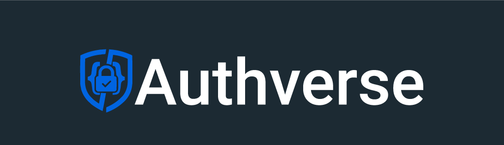

# Authverse

Authverse es una CLI moderna, ligera y amigable para el desarrollador de autenticación que te ayuda a configurar un **sistema de autenticación completo con un solo comando**.

Proporciona pantallas de autenticación listas para usar, bases de datos completamente configuradas con Prisma o Drizzle, integración con Better Auth y flujos de autenticación seguros, todo generado al instante dentro de tu proyecto.

Authverse está diseñado para desarrolladores que buscan **autenticación rápida, limpia y profesional**, sin tener que pasar días configurando todo manualmente.

---

## ¿Qué es Authverse?

Authverse es una herramienta CLI que crea una configuración completa de autenticación para tu proyecto Next.js y TanStack Start` project.  
Integra automáticamente:

- **Better Auth** marco de trabajo moderno de autenticación
- **Pantallas de autenticación Shadcn/ui**
- **Configuración de base de datos Prisma o Drizzle**
- **Proveedores de OAuth**
- **Rutas de API + estructura de carpetas**
- **Variables de entorno**
- **Soporte completo para TypeScript**

En lugar de instalar manualmente decenas de paquetes, configurar rutas del backend y diseñar pantallas de interfaz, Authverse hace todo por ti.

Con solo **un único comando de ejecución**, obtienes:

- Configuración completa de autenticación para backend y frontend
- Interfaz de autenticación completamente generada
- OAuth + correo electrónico/contraseña
- Seguridad lista para producción
- Base de código amigable para el desarrollador

---

## Características

- **Iniciar sesión**
- **Registrarse**
- **Olvidé mi contraseña**
- **Restablecer contraseña**
- **OAuth de Google**
- **OAuth de GitHub**
- **Better Auth integrado**
- **Pantallas de autenticación Shadcn/ui**
- **Soporte para bases de datos Prisma o Drizzle**
- **Estructura de carpetas moderna**
- **Soporte para TypeScript**
- **Configuración lista para producción**

---

## Inicio rápido

Ejecuta el siguiente comando para inicializar Authverse:

```bash
npx authverse@latest init
```

Authverse te guiará paso a paso para que elijas:

- Tu marco de trabajo de interfaz
- Tu base de datos Prisma o Drizzle
- Si deseas incluir pantallas de autenticación
- Y generará automáticamente todo por ti

Después de ejecutar la CLI, tu proyecto estará completamente listo con  
**Better Auth**, **componentes de Shadcn/ui** y **integración de base de datos**.

---

## Documentación

La documentación completa está disponible en el sitio web oficial:  
**https://authverse.dev**

---

## Licencia

Authverse está licenciado bajo MIT.
Creado y mantenido por **Abdirahman Mohamoud**.
